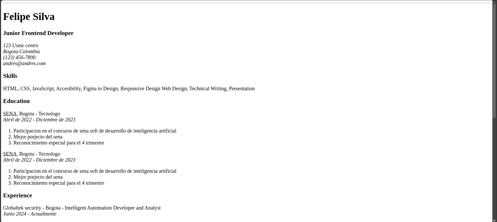

# Frontend projects from Roadmap.sh [Roadmap.sh](https://roadmap.sh/frontend)

## HTML

1. [HTML single page cv](https://roadmap.sh/projects/single-page-cv)

## CSS

1.

## JavaScript

1.

---

Bellow we have a preview of the projects made in this path

  

---

**This repo store the main course to follow up the road map to become a full stack developer**

_Developed by [Felipe Silva](https://github.com/and3sil4)_
